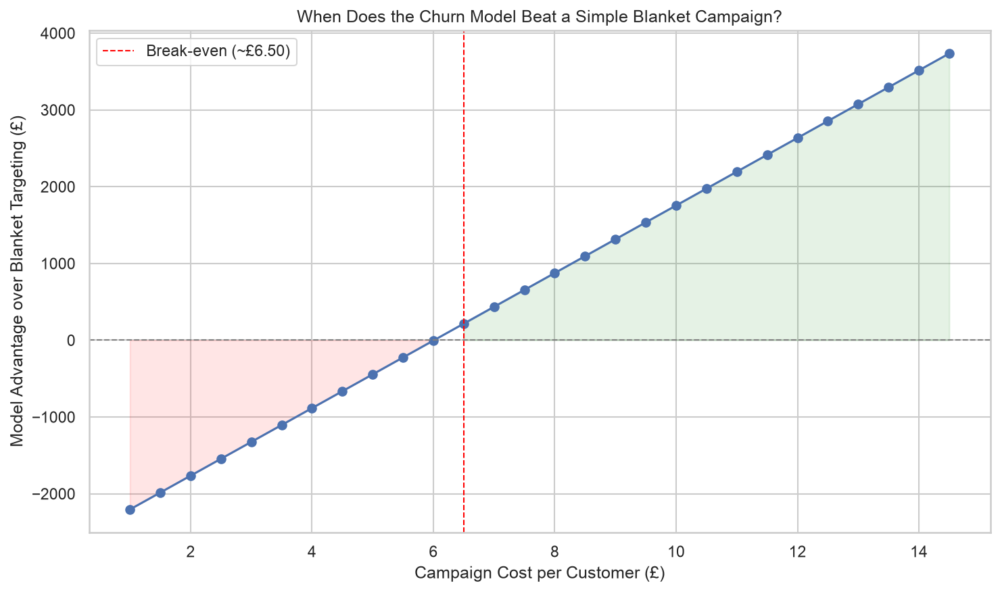

# E-Commerce Customer Churn Prediction

Predicting customer churn on a real UK-based online retailer's transaction data, and answering a more important question than "can we predict churn?" — **when is it actually worth using a model to do so?**

## Business Question

Which customers are at risk of churning, and how should a retention campaign be targeted to maximize business value — versus simply contacting every customer?

## Key Findings

- Built an XGBoost churn classifier achieving **0.935 ROC-AUC**, using a churn definition (75 days of inactivity) derived empirically from this customer base's actual reorder behavior, not an arbitrary round number.
- **Model-based targeting only beats a simple "email everyone" campaign once the cost of contacting a customer exceeds ~£6.50.** Below that, blanket targeting is cheaper and equally effective — a finding with direct implications for how a business should structure retention campaigns by cost tier (cheap emails: blanket; expensive interventions like phone calls: model-targeted).
- Identified and corrected a data leakage bug during development, where an early feature design unintentionally re-encoded the churn label itself (producing an unrealistic 0.98 AUC) — documented transparently in the modeling notebook rather than hidden.

## Live Dashboard

An interactive Streamlit dashboard lets you explore customer risk scores and simulate the ROI trade-off yourself:
```bash
streamlit run app/streamlit_app.py
```

## Project Structure

```
ecommerce-churn-prediction/
│
├── notebooks/
│   ├── 01_data_ingestion.ipynb          # Load and clean raw transaction data
│   ├── 02_eda.ipynb                     # Repeat-purchase behavior, cohort retention, RFM distributions
│   ├── 03_feature_engineering.ipynb     # RFM, trend, and behavioral features + churn label
│   ├── 04_modeling.ipynb                # Model comparison, leakage discovery/fix, threshold tuning
│   └── 05_evaluation_business_impact.ipynb  # Final results, business impact, limitations
│
├── src/
│   ├── data_ingestion.py                # KaggleHub download logic
│   ├── features.py                      # Reusable feature engineering functions
│   └── config.py                        # Central constants (churn window, business assumptions, paths)
│
├── app/
│   └── streamlit_app.py                 # Interactive risk explorer + ROI simulator
│
├── models/
│   └── churn_model.pkl                  # Trained XGBoost model
│
├── data/                                # Not tracked in git — see Setup below
│   ├── raw/
│   ├── interim/
│   └── processed/
│
├── reports/
│   └── figures/                         # Saved charts for this README and the stakeholder memo
│
└── requirements.txt
```

## Data

**Source:** [UCI Online Retail II](https://www.kaggle.com/datasets/mashlyn/online-retail-ii-uci) — real transaction data from a UK-based online gift/wholesale retailer, December 2009–December 2011.

**Why this dataset:** an earlier version of this project used the Olist Brazilian E-Commerce dataset, but 97% of Olist customers were one-time buyers — leaving almost no repeat-purchase signal for a churn model to learn from. Online Retail II has genuine repeat-purchase behavior (72% of customers reordered at least once), making churn a meaningful, learnable target. This pivot — and the reasoning behind it — is documented in `02_eda.ipynb`.

**After cleaning:** 5,878 customers, 824,293 transaction line items (Dec 2009–Dec 2011). Rows with missing customer IDs (guest checkouts, ~23%) were dropped, since customer-level analysis requires an identifiable customer. Cancelled/returned orders were retained (flagged, not deleted) to preserve return-rate as a feature.

## Churn Definition

A customer is considered churned if **no purchase has occurred within 75 days of their last order.**

This threshold wasn't picked arbitrarily — it sits between the 75th percentile (61 days) and 80th percentile (76 days) of natural gaps between consecutive orders across the customer base, chosen to flag customers who've moved meaningfully beyond typical reorder behavior while leaving enough lead time for a retention intervention to be actionable. Full derivation in `02_eda.ipynb`.

This produces a healthy, balanced target: **54% churned / 46% active.**

## Modeling Approach

Three models were compared on a held-out 20% test set:

| Model | ROC-AUC | Precision | Recall | F1 |
|---|---|---|---|---|
| Logistic Regression | 0.904 | 0.842 | 0.871 | 0.856 |
| Random Forest | 0.918 | 0.836 | 0.854 | 0.845 |
| **XGBoost** | **0.935** | **0.857** | 0.860 | **0.858** |

XGBoost was selected as the final model. The decision threshold was tuned to **0.35** (below the default 0.5) to favor recall — in this business context, missing a genuine churner is costlier than a false alarm, given a low-cost retention campaign.

**Top predictive features:** purchase frequency, tenure, spend variability, and recent-vs-historical order trend. Full feature list and rationale in `03_feature_engineering.ipynb`; feature importance analysis in `04_modeling.ipynb`.

## Business Impact

Rather than stopping at a good AUC score, this project asks: **does the model actually create more value than a naive strategy?**

Two retention strategies were compared: contacting only the model's flagged at-risk customers ("model-targeted") versus contacting every customer ("blanket"). At a low campaign cost (e.g., a generic email, ~£3/customer), blanket targeting narrowly wins — wasted spend on false positives barely matters when contact is this cheap. As campaign cost rises (e.g., a phone call or a larger discount), the model's precision increasingly pays for itself, crossing over to a clear advantage around **£6.50 per customer** and reaching a **~£19,400 advantage at £50/customer**.



**Practical recommendation:** use cheap, blanket campaigns for low-cost interventions, and reserve model-based targeting for expensive, high-touch retention efforts where being selective genuinely matters.

Full derivation, including a sensitivity analysis across campaign costs, in `05_evaluation_business_impact.ipynb`.

## Limitations

- Campaign cost (£3) and success rate (15%) are documented assumptions (`src/config.py`), not observed data — a real deployment would need A/B testing to calibrate these, which would shift the £6.50 break-even point.
- `tenure_days` has a structural relationship with the churn label (`tenure_days ≥ recency_days` by definition), so part of its predictive power reflects this constraint rather than pure behavioral insight — discussed in `04_modeling.ipynb`.
- Train/test split is random, not time-based; a production deployment should validate on a strict time-based holdout.
- Results reflect one retailer over one ~2-year period; churn drivers likely differ across industries and time periods.

## Setup

```bash
# clone and enter the repo
git clone https://github.com/Dyna1410-blip/Churn-Prediction
cd ecommerce-churn-prediction

# create and activate a virtual environment
python -m venv venv
source venv/bin/activate    # Windows: venv\Scripts\activate

# install dependencies
pip install -r requirements.txt

# set up Kaggle credentials in a .env file (see src/data_ingestion.py)
# KAGGLE_USERNAME=your-username
# KAGGLE_KEY=your-api-key

# run the pipeline
python -m src.data_ingestion       # downloads raw data to data/raw/
# then run notebooks/01 through 05 in order

# launch the dashboard
streamlit run app/streamlit_app.py
```

## Tech Stack

Python, pandas, scikit-learn, XGBoost, Streamlit, matplotlib/seaborn, KaggleHub

## What I'd Do With More Time

- Time-based train/test validation instead of random split
- A/B test framework to replace assumed campaign cost/success-rate with real experimental data
- Customer lifetime value (CLV) modeling to complement the binary churn label
- Separate modeling treatment for one-time buyers (~28% of the base) vs. established repeat customers